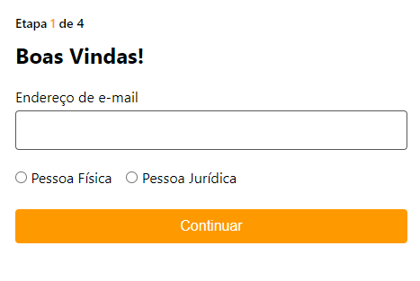
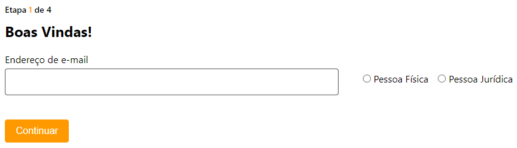

# Desafio Técnico Web - MB

  
  

## Clonar projeto
O projeto pode ser clonado em [Repositóio desafio Técnico MB](https://github.com/eufabionovais/desafio-mb.git)

Após clonado, você terá acesso às pastas de **backend** e **frontend** do projeto.

## Instalando as dependências
Após abrir o projeto em seu editor preferido, estando dentro do pasta principal do projeto, acesse o diretório do backend com o comando **cd backend** e após isso, execute **npm install**.

Feito isso, repita os mesmos passos iniciais para a instalação das dependências de frontend. Acesse a pasta através do comando **cd frontend** e execute **npm install**. Após a instalação ter sido concluida, execute também **npm run build** para gerar o build do projeto frontend que será acessado através da API criada no backend.

## Executando o projeto
Se tudo ocorreu como o esperado, basta executar os seguintes comandos para ter o projeto sendo executando localmente:
No diretório do backend, execute **npm start** para iniciar o servidor Node. A aplicação será executada 
No diretório do frontend, execute **npm run dev**. Isso fará com que o projeto seja executado utilizando o Vite, no geral, em http://localhost:5173/

## Acessando as rotas de registro
O intuito é que possamos acessar o projeto através de rotas da nossa API Node, que estará rodando em http://localhost:3000, e podemos acessar a nossa rota de registro através de http://localhost:3000/registration

## Tudo ok? 
Nesse ponto você deverá visualizar a página inicial de registro:

***Versão mobile:**
 

  

***Versão desktop:**
 

Agora basta seguir as etapas e realizar seu cadastro :)

